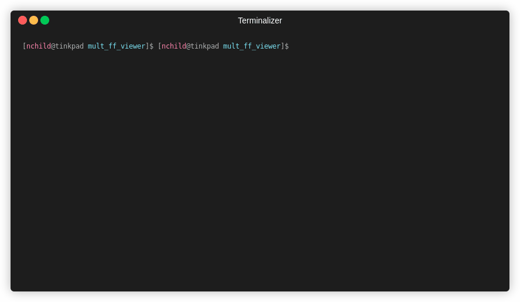
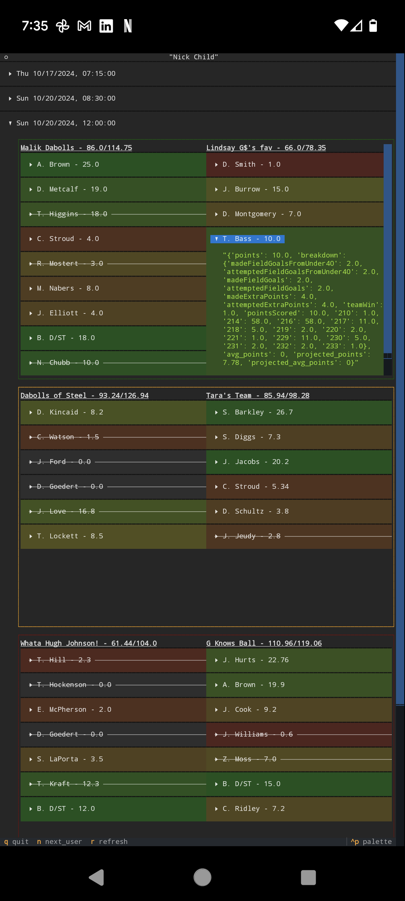

# View all your Fantasy Football leagues at once!

Special thanks to [espn-api](https://github.com/cwendt94/espn-api) for making this way easier!

Make sure to clone submodules as well: `git submodule update --init --recursive`

Python dependencies: `textual`, `configparser`

`python3 main.py`:

